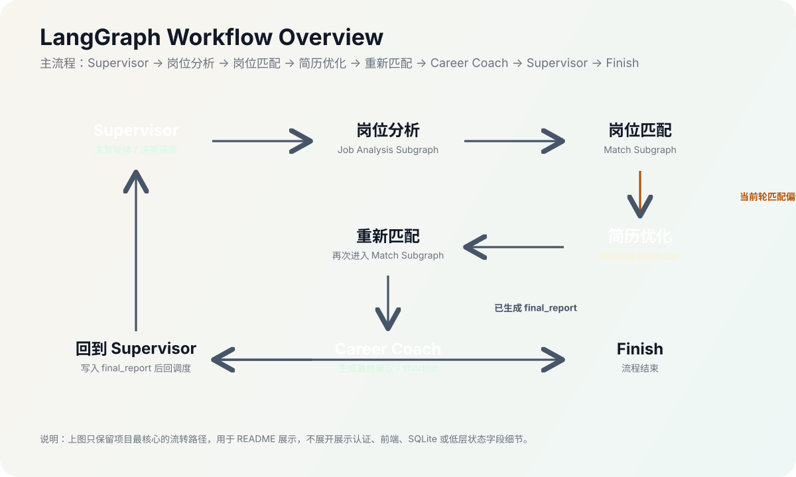
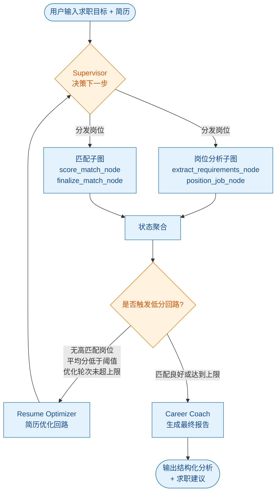
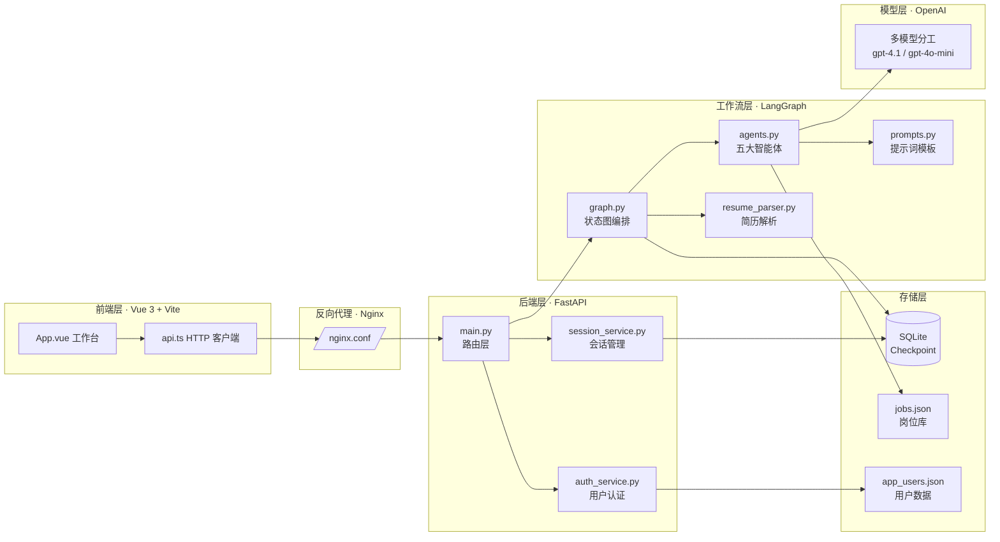
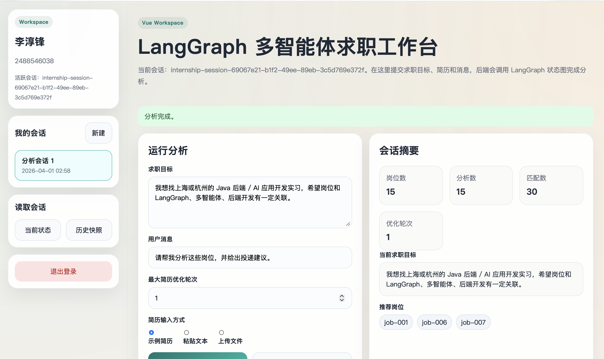

<div align="center">

# 🎯 job-match-workflow

**基于 LangGraph 的多智能体职业规划助手，让求职分析像流水线一样自动运转**

[](https://www.python.org/)
[](https://github.com/langchain-ai/langgraph)
[](https://fastapi.tiangolo.com/)
[](https://vuejs.org/)
[](https://vitejs.dev/)
[](https://www.sqlite.org/)
[](https://docs.docker.com/compose/)

[快速开始](#-快速开始) · [核心亮点](#-核心亮点) · [系统流程](#-系统流程) · [技术架构](#-技术架构) · [项目结构](#-项目结构) · [能力矩阵](#-能力矩阵) · [常用命令](#-常用命令)

</div>

> 一个围绕真实求职任务构建的多智能体 AI 应用：用户注册登录后，可创建多个分析会话、输入求职目标与简历，系统通过 `Send` 并行分析多个岗位、评估简历匹配度，并在匹配偏低时自动触发简历优化回路，最终输出结构化岗位分析与求职建议。

<p align="center">
  
</p>



---

## ✨ 核心亮点

<table>
  <tr>
    <td width="50%" align="left"><b>🎯 真实场景驱动</b></td>
    <td width="50%" align="left"><b>🤖 多智能体协作</b></td>
  </tr>
  <tr>
    <td>围绕「找第一段实习」设计业务流程，而非泛化聊天 Demo，工作流贴合真实求职决策链路。</td>
    <td><code>Supervisor</code>、<code>Job Analyst</code>、<code>Resume Reviewer</code>、<code>Resume Optimizer</code>、<code>Career Coach</code> 五大角色分工协作。</td>
  </tr>
  <tr>
    <td align="left"><b>🔗 LangGraph 能力完整落地</b></td>
    <td align="left"><b>🧠 多模型分工</b></td>
  </tr>
  <tr>
    <td>完整使用 <code>Command</code>、<code>Send</code>、子图、状态聚合、低分回路、checkpoint 等核心能力。</td>
    <td>支持按角色分配不同模型（如 Supervisor 用 <code>gpt-4.1-mini</code>，Coach 用 <code>gpt-4.1</code>），兼顾效果与成本。</td>
  </tr>
  <tr>
    <td align="left"><b>💾 SQLite Checkpoint</b></td>
    <td align="left"><b>🌐 前后端分离</b></td>
  </tr>
  <tr>
    <td>支持自定义 <code>thread_id</code>、会话恢复、历史快照读取，分析过程可断点续跑。</td>
    <td><code>FastAPI</code> 后端 + <code>Vue 3 + Vite</code> 前端，<code>Nginx</code> 反向代理，<code>Docker Compose</code> 一键启动。</td>
  </tr>
</table>

---

## 🔄 系统流程



### 低分回路触发条件

- 当前轮没有高匹配岗位
- 当前轮平均分低于阈值
- 当前优化轮次未超过上限

---

## 🚀 快速开始

### 步骤 1：克隆仓库

```bash
git clone https://github.com/your-username/job-match-workflow.git
cd job-match-workflow
```

### 步骤 2：安装 Python 依赖

```bash
pip install -r requirements.txt
```

### 步骤 3：配置环境变量

```bash
cp .env.example .env
```

`.env` 示例：

```bash
OPENAI_API_KEY=your_api_key_here
OPENAI_BASE_URL=https://api.openai.com/v1
OPENAI_MODEL=gpt-4o-mini
SUPERVISOR_MODEL=gpt-4.1-mini
ANALYST_MODEL=gpt-4o-mini
REVIEWER_MODEL=gpt-4.1
OPTIMIZER_MODEL=gpt-4.1
COACH_MODEL=gpt-4.1
APP_AUTH_SECRET=replace-with-your-own-secret
```

### 步骤 4：启动后端

```bash
uvicorn backend.app.main:app --reload --host 127.0.0.1 --port 8000
```

### 步骤 5：启动前端

```bash
cd frontend
npm install
npm run dev -- --host 127.0.0.1 --port 5173
```

### ✅ 启动验证

| 服务 | 访问地址 | 预期返回 |
| :--- | :--- | :--- |
| 前端工作台 | `http://127.0.0.1:5173` | 显示登录 / 注册页面 |
| 后端健康检查 | `http://127.0.0.1:8000/api/health` | `{"status": "ok"}` |
| API 文档 | `http://127.0.0.1:8000/docs` | FastAPI Swagger UI |

---

## 🏗️ 技术架构



---

## 📁 项目结构

```text
.
├── README.md
├── requirements.txt
├── docker-compose.yml
├── .env.example
├── backend/
│   ├── Dockerfile
│   └── app/
│       ├── __init__.py
│       ├── main.py
│       └── schemas.py
├── frontend/
│   ├── Dockerfile
│   ├── index.html
│   ├── nginx.conf
│   ├── package.json
│   ├── tsconfig.json
│   ├── vite.config.ts
│   └── src/
│       ├── api.ts
│       ├── App.vue
│       ├── main.ts
│       ├── styles.css
│       └── types.ts
├── docs/
│   ├── graph-overview.svg
│   └── image.png
├── data/
│   ├── jobs.json
│   ├── sample_resume.md
│   └── sample_resume.pdf
└── src/
    ├── __init__.py
    ├── agents.py
    ├── auth_service.py
    ├── graph.py
    ├── main.py
    ├── models.py
    ├── prompts.py
    ├── resume_parser.py
    ├── session_service.py
    └── utils.py
```

---

## 📊 能力矩阵

| 模块 | 功能 | 技术实现 | 配置需求 |
| :--- | :--- | :--- | :--- |
| **用户认证** | 注册 / 登录 / 身份校验 | `APP_AUTH_SECRET` + JWT 风格 token | 需要 `APP_AUTH_SECRET` |
| **会话管理** | 多会话创建 / 切换 / 历史快照 | SQLite checkpoint + `thread_id` | 自动创建 `checkpoints/` |
| **岗位分析** | 并行提取多个岗位要求 | `Send` 分发到子图 | 需配置 `ANALYST_MODEL` |
| **简历匹配** | 评估简历与岗位匹配度并打分 | `Send` 并行 + 状态聚合 | 需配置 `REVIEWER_MODEL` |
| **简历优化** | 低分时触发优化回路 | `Command` 路由 + 轮次上限 | 需配置 `OPTIMIZER_MODEL` |
| **求职建议** | 生成最终结构化报告 | `Career Coach` 智能体 | 需配置 `COACH_MODEL` |
| **简历上传** | 支持 `txt / md / pdf` 文件 | `pypdf` 解析 + 文本提取 | 已内置 |
| **Docker 部署** | 一键启动前后端 + Nginx | `docker compose up --build` | 需 Docker 环境 |

### 后端 API 一览

| 方法 | 路径 | 说明 |
| :--- | :--- | :--- |
| `POST` | `/api/auth/register` | 用户注册 |
| `POST` | `/api/auth/login` | 用户登录 |
| `GET` | `/api/auth/me` | 获取当前用户信息 |
| `GET` | `/api/jobs` | 获取岗位列表 |
| `GET` | `/api/sessions` | 获取用户所有会话 |
| `POST` | `/api/sessions` | 创建新会话 |
| `POST` | `/api/sessions/{thread_id}/activate` | 激活指定会话 |
| `GET` | `/api/sessions/{thread_id}` | 获取会话详情 |
| `GET` | `/api/sessions/{thread_id}/history` | 获取会话历史快照 |
| `POST` | `/api/analysis/run` | 启动求职分析工作流 |
| `GET` | `/api/health` | 健康检查 |

### 前端工作台能力

- 注册 / 登录
- 查看并切换历史会话
- 新建分析会话
- 输入求职目标和用户消息
- 粘贴简历文本或上传简历文件
- 启动新分析 / 继续历史会话
- 查看最终报告与当前会话摘要
- 查看历史快照、岗位分析结果与匹配结果

前端运行截图：



---

## 🛠️ 常用命令

```bash
# ========== 本地开发 ==========

# 启动后端（带热重载）
uvicorn backend.app.main:app --reload --host 127.0.0.1 --port 8000

# 启动前端
cd frontend
npm run dev -- --host 127.0.0.1 --port 5173

# 安装前端依赖
cd frontend && npm install

# 构建前端生产包
cd frontend && npm run build

# ========== Docker 部署 ==========

# 一键构建并启动（前台）
docker compose up --build

# 后台运行
docker compose up --build -d

# 停止并清理容器
docker compose down

# 查看日志
docker compose logs -f

# ========== 环境配置 ==========

# 复制环境变量模板
cp .env.example .env

# 安装 Python 依赖
pip install -r requirements.txt
```

### Docker 部署访问地址

| 服务 | 地址 |
| :--- | :--- |
| 前端 | `http://localhost:5173` |
| 后端 | `http://localhost:8000` |
| 健康检查 | `http://localhost:8000/api/health` |

### 运行时数据说明

以下文件不建议提交，已在 `.gitignore` 中忽略：

- `.env`
- `checkpoints/`
- `data/app_users.json`
- `frontend/node_modules/`
- `frontend/dist/`

---

<div align="center">

**🚀 让 LangGraph 把求职分析做成可并行、可回路、可恢复的状态图系统**

Made with ❤️ by [your-username](https://github.com/your-username)

</div>
